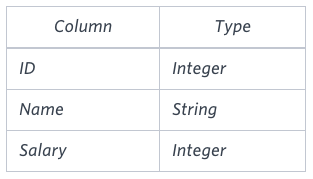

## 🧑‍💻 Basic Level SQL Questions

### Case 1 - Revising the Select Query I

Q. Query all columns for all American cities in the CITY table with populations larger than 100000. The CountryCode for America is USA.

### Case 2 - Revising the Select Query II

Q. Query the NAME field for all American cities in the CITY table with populations larger than 120000. The CountryCode for America is USA.

### Case 3 - Select All

Q. Query all columns (attributes) for every row in the CITY table.

### Case 4 - Select by ID

Q. Query all columns for a city in CITY with the ID 1661.

### Case 5 - Japanese Cities' Attributes

Q. Query all attributes of every Japanese city in the CITY table. The COUNTRYCODE for Japan is JPN.

### Case 6 - Japanese Cities' Names

Q. Query the names of all the Japanese cities in the CITY table. The COUNTRYCODE for Japan is JPN. 

### Case 7 - Weather Observation Station 1

Q. Query a list of CITY and STATE from the STATION table.

### Case 8 - Weather Observation Station 3

Q. Query a list of CITY names from STATION for cities that have an even ID number. Print the results in any order, but exclude duplicates from the answer.

### Case 9 - Weather Observation Station 4

Q. Find the difference between the total number of CITY entries in the table and the number of distinct CITY entries in the table.

### Case 10 - Weather Observation Station 5

Q. Query the two cities in STATION with the shortest and longest CITY names, as well as their respective lengths (i.e.: number of characters in the name). If there is more than one smallest or largest city, choose the one that comes first when ordered alphabetically.

### Case 11 - Weather Observation Station 6

Q. Query the list of CITY names starting with vowels (i.e., a, e, i, o, or u) from STATION. Your result cannot contain duplicates.

### Case 12 - Weather Observation Station 7

Q. Query the list of CITY names ending with vowels (a, e, i, o, u) from STATION. Your result cannot contain duplicates.

### Case 13 - Weather Observation Station 8

Q. Query the list of CITY names from STATION which have vowels (i.e., a, e, i, o, and u) as both their first and last characters. Your result cannot contain duplicates.

### Case 14 - Weather Observation Station 9

Q. Query the list of CITY names from STATION that do not start with vowels. Your result cannot contain duplicates.

### Case 15 - Weather Observation Station 10

Q. Query the list of CITY names from STATION that do not end with vowels. Your result cannot contain duplicates.

### Case 16 - Weather Observation Station 11

Q. Query the list of CITY names from STATION that either do not start with vowels or do not end with vowels. Your result cannot contain duplicates.

### Case 17 - Weather Observation Station 12

Q. Query the list of CITY names from STATION that do not start with vowels and do not end with vowels. Your result cannot contain duplicates.

### Case 18 - Higher Than 75 Marks

Q. Query the Name of any student in STUDENTS who scored higher than 75 Marks. Order your output by the last three characters of each name. If two or more students both have names ending in the same last three characters (i.e.: Bobby, Robby, etc.), secondary sort them by ascending ID.

### Case 19 - Employee Names

Q. Write a query that prints a list of employee names (i.e.: the name attribute) from the Employee table in alphabetical order.

### Case 20 - Employee Salaries

Q. Write a query that prints a list of employee names (i.e.: the name attribute) for employees in Employee having a salary greater than $2000 per month who have been employees for less than 10 months. Sort your result by ascending employee_id.

### Case 21 - Type of Triangle

Q. Write a query identifying the type of each record in the TRIANGLES table using its three side lengths. Output one of the following statements for each record in the table:

 - Equilateral: It's a triangle with 3 sides of equal length.
 - Isosceles: It's a triangle with 2 sides of equal length.
 - Scalene: It's a triangle with 3 sides of differing lengths.
 - Not A Triangle: The given values of A, B, and C don't form a triangle.

### Case 22 - Revising Aggregations The Count Function

Q. Query a count of the number of cities in CITY having a Population larger than 100,000.

### Case 23 - Revising Aggregations The Sum Function

Q. Query the total population of all cities in CITY where District is California.

### Case 24 - Revising Aggregations Averages

Q. Query the average population of all cities in CITY where District is California.

### Case 25 - Average Population

Q. Query the average population for all cities in CITY, rounded down to the nearest integer.

### Case 26 - Japan Population

Q. Query the sum of the populations for all Japanese cities in CITY. The COUNTRYCODE for Japan is JPN.

### Case 27 - Population Density Difference

Q. Query the difference between the maximum and minimum populations in CITY.

### Case 28 - The Blunder

Samantha was tasked with calculating the average monthly salaries for all employees in the EMPLOYEES table, but did not realize her keyboard's 0 key was broken until after completing the calculation. She wants your help finding the difference between her miscalculation (using salaries with any zeros removed), and the actual average salary.

Write a query calculating the amount of error (i.e.:  average monthly salaries), and round it up to the next integer.

### Case 29 - Top Earners

Q. We define an employee's total earnings to be their monthly salary x months worked, and the maximum total earnings to be the maximum total earnings for any employee in the Employee table. Write a query to find the maximum total earnings for all employees as well as the total number of employees who have maximum total earnings. Then print these values as 2 space-separated integers.

### Case 30 - Weather Observation Station 2

Q. Query the following two values from the STATION table:

The sum of all values in LAT_N rounded to a scale of 2 decimal places.
The sum of all values in LONG_W rounded to a scale of 2 decimal places.

### Case 31 - Weather Observation Station 13

Q. Query the sum of Northern Latitudes (LAT_N) from STATION having values greater than 38.7880 and less than 137.2345. Truncate your answer to 4 decimal places.

### Case 32 - Weather Observation Station 14

Q. Query the greatest value of the Northern Latitudes (LAT_N) from STATION that is less than 137.2345. Truncate your answer to 4 decimal places.

### Case 33 - Weather Observation Station 15

Q. Query the Western Longitude (LONG_W) for the largest Northern Latitude (LAT_N) in STATION that is less than 137.2345. Round your answer to 4 decimal places.

### Case 34 - Weather Observation Station 16

Q. Query the smallest Northern Latitude (LAT_N) from STATION that is greater than 38.7780. Round your answer to 4 decimal places.

### Case 35 - Weather Observation Station 17

Q. Query the Western Longitude (LONG_W) where the smallest Northern Latitude (LAT_N) in STATION is greater than 38.7780. Round your answer to 4 decimal places.

### Case 36 - Population Census

Q. Given the CITY and COUNTRY tables, query the sum of the populations of all cities where the CONTINENT is 'Asia'.

Note: CITY.CountryCode and COUNTRY.Code are matching key columns.

### Case 37 - African Cities

Q. Given the CITY and COUNTRY tables, query the names of all cities where the CONTINENT is 'Africa'.

Note: CITY.CountryCode and COUNTRY.Code are matching key columns.

### Case 38 - Average Population of Each Continent

Q. Given the CITY and COUNTRY tables, query the names of all the continents (COUNTRY.Continent) and their respective average city populations (CITY.Population) rounded down to the nearest integer.

Note: CITY.CountryCode and COUNTRY.Code are matching key columns.

### Case 39

Q. P(R) represents a pattern drawn by Julia in R rows. The following pattern represents P(5):

* * * * *

* * * *
 

* * *
 

* *
 

*

Write a query to print the pattern P(20).

### Case 40

Q. P(R) represents a pattern drawn by Julia in R rows. The following pattern represents P(5):

*

* *

* * *

* * * *

* * * * *

Write a query to print the pattern P(20).
