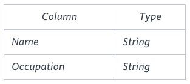
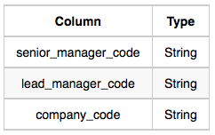
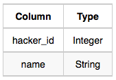

## 🧑‍💻 Intermediate Level SQL Questions

### Case 1 - The PADS

Q1. Query an alphabetically ordered list of all names in OCCUPATIONS, immediately followed by the first letter of each profession as a parenthetical (i.e.: enclosed in parentheses). For example: AnActorName(A), ADoctorName(D), AProfessorName(P), and ASingerName(S).

Q2. Query the number of ocurrences of each occupation in OCCUPATIONS. Sort the occurrences in ascending order, and output them in the following format:
{There are a total of [occupation_count] [occupation]s} where [occupation_count] is the number of occurrences of an occupation in OCCUPATIONS and [occupation]is the lowercase occupation name. If more than one Occupation has the same [occupation_count], they should be ordered alphabetically.

**Note:** There will be at least two entries in the table for each type of occupation.

### Case 2 - Binary Tree Nodes

Q. You are given a table, BST, containing two columns: N and P, where N represents the value of a node in Binary Tree, and P is the parent of N.

Write a query to find the node type of Binary Tree ordered by the value of the node. Output one of the following for each node:

 - Root: If node is root node.
 - Leaf: If node is leaf node.
 - Inner: If node is neither root nor leaf node.

### Case 3 - New Companies

Q. Given the table schemas below, write a query to print the company_code, founder name, total number of lead managers, total number of senior managers, total number of managers, and total number of employees. Order your output by ascending company_code.

**Note:**

 - The tables may contain duplicate records.
 - The company_code is string, so the sorting should not be numeric. For example, if the company_codes are C_1, C_2, and C_10, then the ascending company_codes will be C_1, C_10, and C_2.

### Case 4 - Weather Observation Station 18

Q. Consider P1(a, b) and P2(c, d) to be two points on a 2D plane.

 - a happens to equal the minimum value in Northern Latitude (LAT_N in STATION).
 - b happens to equal the minimum value in Western Longitude (LONG_W in STATION).
 - c happens to equal the maximum value in Northern Latitude (LAT_N in STATION).
 - d happens to equal the maximum value in Western Longitude (LONG_W in STATION).

Query the Manhattan Distance between points P1 and P2 and round it to a scale of 4 decimal places.

### Case 5 - Weather Observation Station 19

Q. Consider P1(A, C) and P2(B, D) to be two points on a 2D plane where (A, B) are the respective minimum and maximum values of Northern Latitude (LAT_N) and (C, D) are the respective minimum and maximum values of Western Longitude (LONG_W) in STATION.

Query the Euclidean Distance between points P1 and P2 and format your answer to display 4 decimal digits.

### Case 6 - Weather Observation Station 20

Q. A median is defined as a number separating the higher half of a data set from the lower half. Query the median of the Northern Latitudes (LAT_N) from STATION and round your answer to 4 decimal places.

### Case 7 - The Report

Q. You are given two tables: Students and Grades. Students contains three columns ID, Name and Marks. Grades contains three columns Grade, Min_Mark and Max_Mark

Ketty gives Eve a task to generate a report containing three columns: Name, Grade and Mark. Ketty doesn't want the NAMES of those students who received a grade lower than 8. The report must be in descending order by grade -- i.e. higher grades are entered first. If there is more than one student with the same grade (8-10) assigned to them, order those particular students by their name alphabetically. Finally, if the grade is lower than 8, use "NULL" as their name and list them by their grades in descending order. If there is more than one student with the same grade (1-7) assigned to them, order those particular students by their marks in ascending order.

Write a query to help Eve.

**Note:** Print "NULL" as the name if the grade is less than 8.

### Case 8 - Top Competitors

Q. Julia just finished conducting a coding contest, and she needs your help assembling the leaderboard! Write a query to print the respective hacker_id and name of hackers who achieved full scores for more than one challenge. Order your output in descending order by the total number of challenges in which the hacker earned a full score. If more than one hacker received full scores in same number of challenges, then sort them by ascending hacker_id.

**Note:** Print the their hacker_id and name as 2 space-separated values.

### Case 9 - Ollivander's Inventory

Q. Harry Potter and his friends are at Ollivander's with Ron, finally replacing Charlie's old broken wand.

Hermione decides the best way to choose is by determining the minimum number of gold galleons needed to buy each non-evil wand of high power and age. Write a query to print the id, age, coins_needed, and power of the wands that Ron's interested in, sorted in order of descending power. If more than one wand has same power, sort the result in order of descending age.

### Case 10 - Challenges

Q. Julia asked her students to create some coding challenges. Write a query to print the hacker_id, name, and the total number of challenges created by each student. Sort your results by the total number of challenges in descending order. If more than one student created the same number of challenges, then sort the result by hacker_id. If more than one student created the same number of challenges and the count is less than the maximum number of challenges created, then exclude those students from the result.

### Case 11 - Contest Leaderboard

Q. You did such a great job helping Julia with her last coding contest challenge that she wants you to work on this one, too!

The total score of a hacker is the sum of their maximum scores for all of the challenges. Write a query to print the hacker_id, name, and total score of the hackers ordered by the descending score. If more than one hacker achieved the same total score, then sort the result by ascending hacker_id. Exclude all hackers with a total score of 0 from your result.

### Case 12 - Placements

Q. You are given three tables: Students, Friends and Packages. Students contains two columns: ID and Name. Friends contains two columns: ID and Friend_ID (ID of the ONLY best friend). Packages contains two columns: ID and Salary (offered salary in $ thousands per month).

Write a query to output the names of those students whose best friends got offered a higher salary than them. Names must be ordered by the salary amount offered to the best friends. It is guaranteed that no two students got same salary offer.

